# Installation de Gitea et création de base de données

Tout d'abord, pour pouvoir installer Gitea, il vous faut un debian, en version 11.6 minimum, avec *mate-desktop*, *git* puis *sqlite3* et les autres paquets qui vous ont été demander d'installer dans l'étape précédante : [*Installation Debian automatisée par pré-configuration*].

## Configuration Globale de Git

Après vous vous êtes connectez avec votre compte utilisateur et ouvert un terminal, il vous suffit d'entrer dans votre terminal les commandes *git config --global user.name "Prénom Nom"*, *git config --global user.email "votre@email"* avec comme "user" votre nom utilisateur, et *git config --global init.defaultBranch "master"*, cette étape vous permettera d'éviter des problèmes lors de la création de votre branche par défaut de votre git de projet.

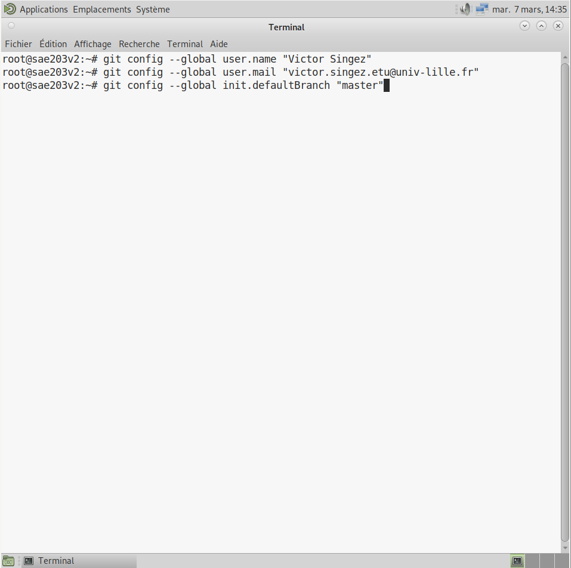{width=25%}

Ensuite, installer le paquet Git-Gui depuis le terminal, avec la commande *apt-get install git-gui*.

{width=25%}

Git-Gui est un git avec une interface graphique, il se lance avec la commande suivante : *git gui [<commande>] [<arguments>]*.
Pour en savoir plus : *<https://git-scm.com/docs/git-gui>*.

GitK est un git fonctionnant sous forme de navigateur de dépôt git, il se lance en utilisant la commande : *gitk [<options>] [<plage de révision>] [--] [<chemin>]*, plus d’information sur GITK : *<https://git-scm.com/docs/gitk>*.

Pour utiliser par défaut le proxy de votre université par exemple, sur l'ensemble de vos projets Git, il faudra utiliser la commande Git : *git config --global http.proxy http://[proxyuser]:[proxypwd]@[proxy.server.com]:[8080]* avec pour *proxyuser* votre nom d'utilisateur, *proxypwd* votre mot de passe et *proxy.server.com* l'URL de votre serveur, pour plus d'informations, consultez le lien suivant : *<https://itsmycode.com/configure-git-proxy/?utm_content=cmp-true>*.

## Redirection des ports

### Accès au port 3000

Pour pouvoir utiliser Gitea, il vous faut utiliser le port 3000 sur votre machine physique et virtuelle comme dans notre cas.
Plus d'informations ici : *<https://www.virtualbox.org/manual/UserManual.html#networkingdetails>*.

Pour cela, dans *VirtualBox*, allez dans le menu de configuration de votre machine virtuelle, puis dans la catégorie *Réseau* cliquez sur *Redirection de ports* puis sur *Ajouter une nouvelle règle de redirection* et réalisez la configuration suivante :

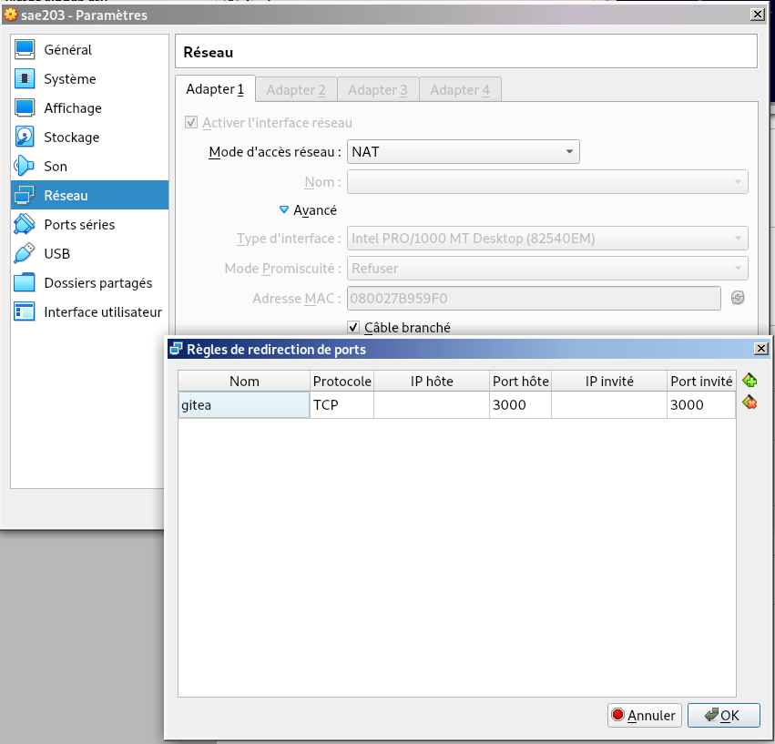{width=25%}

## Installation de Gitea

Tout d'abord, Gitea est une forge logicielle web écrite en Golang qui permet de fournir une interface web de divers dépôts git gérer par une ou plusieurs personnes, c'est un logiciel open source.
Plus d'informations : *<https://fr.wikipedia.org/wiki/Gitea>*.

On peut comparer Gitea à Gitlab mais aussi Github qui sont aussi des dépôts Git.

### Installation binaire

**![att] Attention :** Pour l'installation, vous devez, pour certaines étapes, être connecté en mode *root* dans votre terminal, pour cela entrez la commande *su root* et entrez le mot de passe de votre compte *root*. Cela sera précisez quand ce sera le cas.

[att]:./sources/images/att.jpg "icon"{ width=10% }

**-Etape 1 (*root*) :** Téléchargez les fichiers binaires de Gitea avec wget comme ceci :

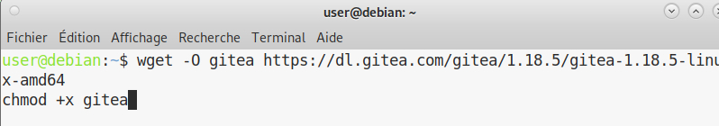{width=25%}

**-Etape 2 : (*root*) :** Faites la même chose que précédemment pour le fichier .asc :

{width=25%}

**Etape 3 : (*root*) :** Vérifier les signatures GPG des fichiers récupérés :

{width=25%}

**Etape 4 :** Il est recommandé pour le bon fonctionnement du serveur Web, la commande suivante :

{width=25%}

**Etape 5 :** Avant de continuer il est conseillé de vérifier que vous avez bien une version 2.0 de Git minimum avec la commande suivante :

{width=25%}

**Etape 6 (*root*) :** Créer un utilisateur pouvant utiliser Gitea comme ceci :

{width=25%}

**Etape 7 (*root*) :** Créer les fichiers nécessaires pour former la structure de Gitea :

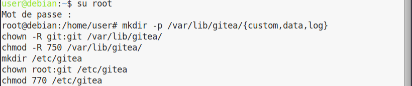{width=25%}

**Etape 8 (*root*) :** Donnez-vous les droits sur les fichiers Gitea et app.ini pour y avoir accès :

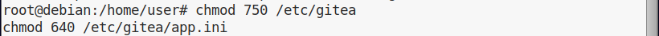{width=25%}

**Etape 9 (*root*) :** Exportez le fichier Gitea et déplacez le fichier binaire :

{width=25%}

{width=25%}

**Les étapes suivantes vont vous permettre d'avoir un démarrage automatique du service Gitea**.

**Etape 10 (*root*) :** Déplacez-vous dans le fichier system puis créez et complétez le fichier gitea.service (récupérez le code ici : *<https://github.com/go-gitea/gitea/blob/main/contrib/systemd/gitea.service>*).

{width=25%}

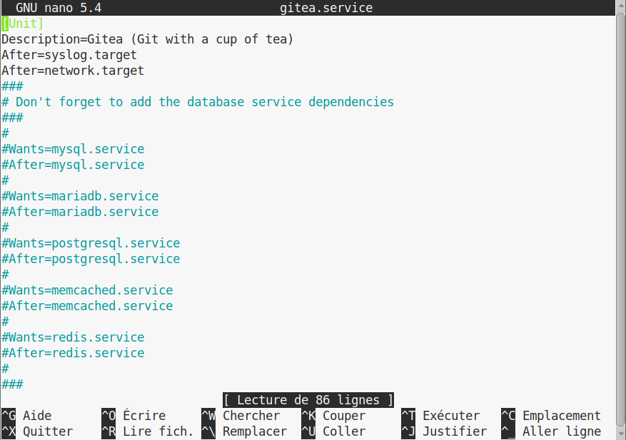{width=25%}

**Etape 11 (*root*) :** Démarrez ensuite le service Gitea :

{width=25%}

**Etape 12 (*root*) :** Installez ensuite *supervisor* :

{width=25%}

**Etape 13 (*root*) :** Créez le fichier permettant l'utilisation de *supervisor* et déplacez-vous y. **Note :** créez ce fichier à l'endroit où est installé votre Gitea.

{width=25%}

{width=25%}

**Etape 14 (*root*) :** Créez et complétez le fichier supervisord.conf (récupérez le code ici : *<https://github.com/go-gitea/gitea/blob/main/contrib/supervisor/gitea>*).

{width=25%}

{width=25%}

**Etape 15 (*root*) :** Démarrez ensuite *supervisor* :

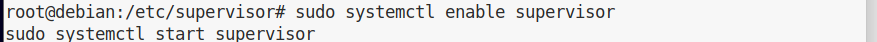{width=25%}

**Etape 16 :** Vérifier, pour finir, le bon fonctionnement de Gitea :

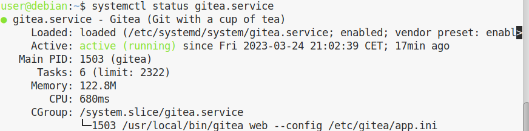{width=25%}

## Utilisation de Gitea depuis le navigateur :

Lancer le navigateur de votre machine physique et ouvrez l'URL : *<http://localhost:3000/>* :

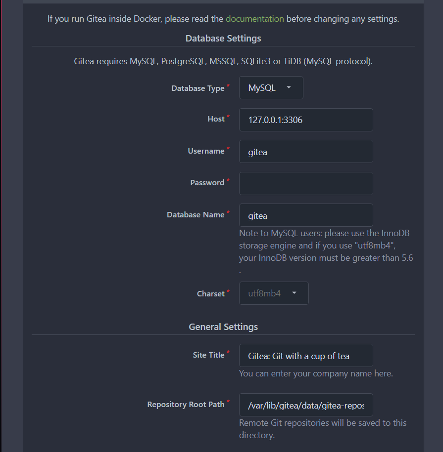{width=25%}

Pour pouvoir utiliser la version Web de Gitea, choisissez en type de base de données *SQLite3* et réalisez les faits suivants :

{width=25%}

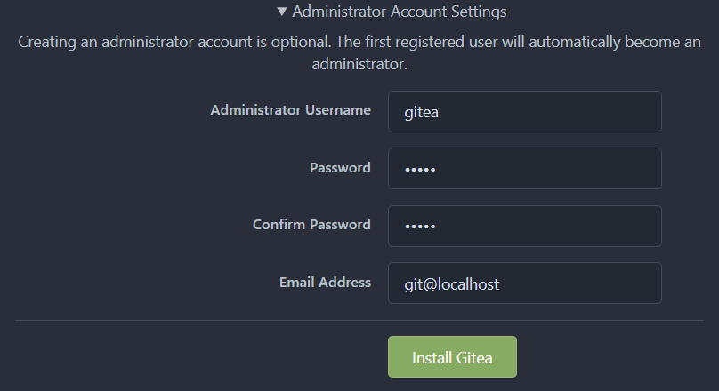{width=25%}

## Réalisation de mise à jour

Mettre à jour Gitea est possible, pour cela arrêter le fonctionnement de Gitea (avec *root*):

{width=25%}

Modifier ensuite la valeur de version de Gitea et récupérez une version plus récente de Gitea via wget (avec *root*):

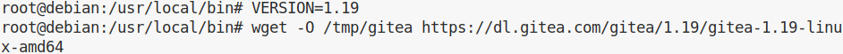{width=25%}

{width=25%}

Puis, redémarrez Gitea (avec *root*) et vérifier son bon fonctionnement :

{width=25%}

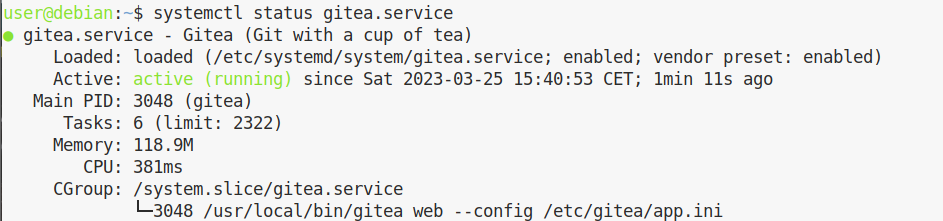{width=25%}
