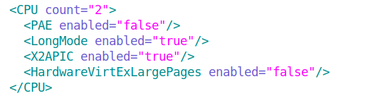
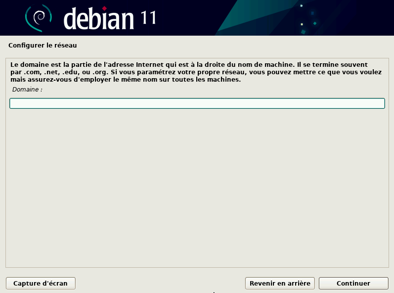
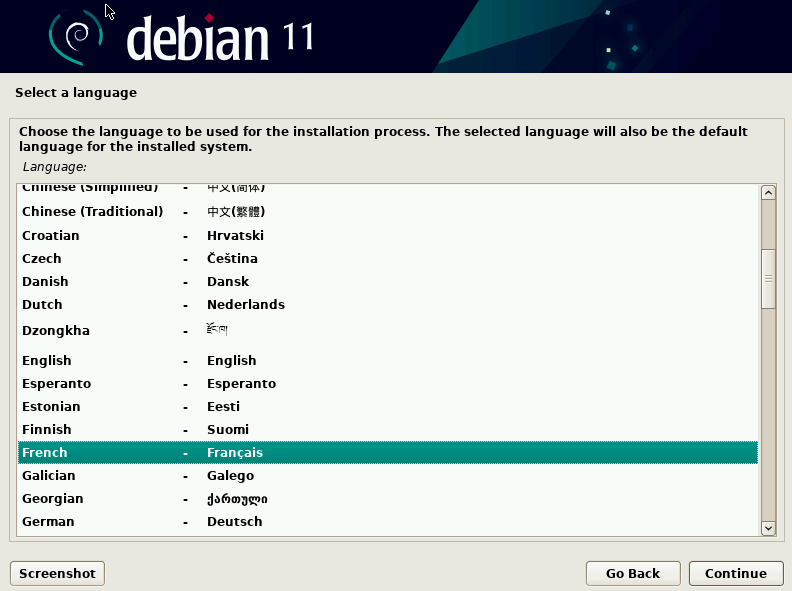
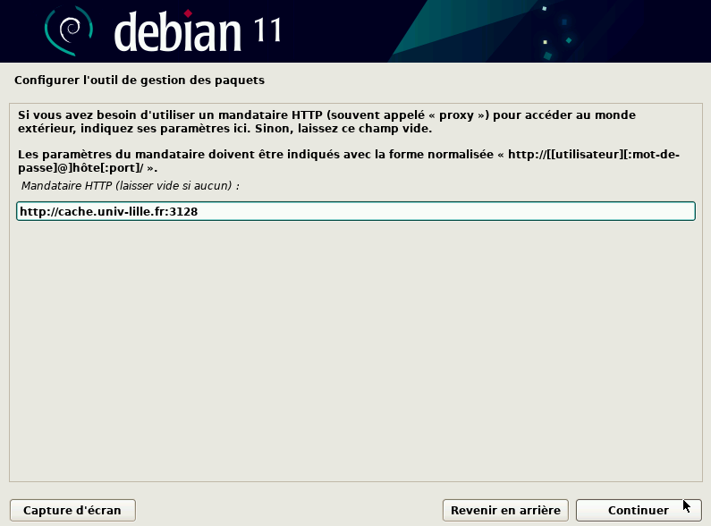
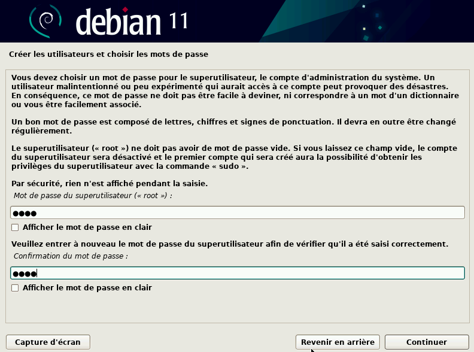
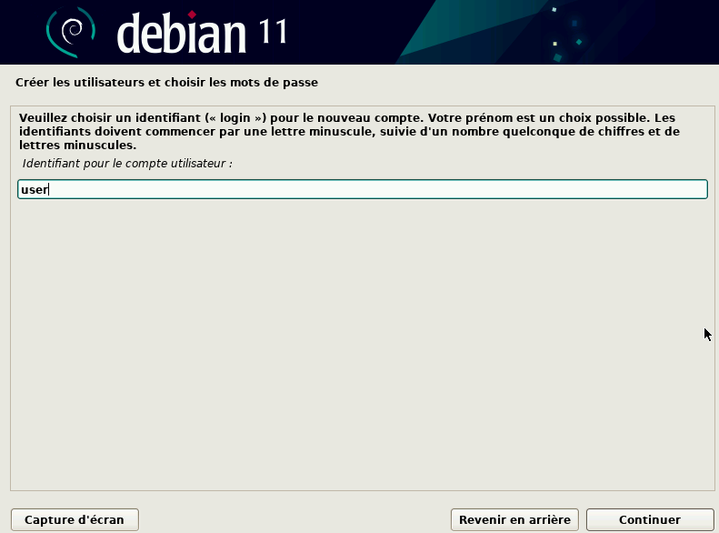

# Installation d'une Machine [Debian](#deb)

## Installation de l'OS
 
### Première étapes à l'installation de l'OS


Tous d'abord, nous devons récupérer une ISO bootable pour lancer une installation de Debian 11.

Pour rappel de qu’est-ce qu’un fichier iso bootable : une ISO bootable est un fichier qui **va permettre d’installer des applications**, de **configurer un système**, il contient des composants logiciels qui permettent de **démarrer directement** l’ordinateur sur un menu de configuration/d'installation avant le chargement du système d’exploitation installé sur la machine si il y en a un.

Pour récupérer une ISO Debian, il suffit simplement d'aller sur le site officiel de Debian : **<https://www.debian.org/>** et de télécharger l'ISO proposée.

Après avoir télécharger l'ISO, on ajoute cette dernière à notre machine VirtualBox en tant que lecteur optique.

\

### Informations Supplémentaires ![Informations supplémentaires]

| Questions | Réponses |
|:-:|-----|
| Que signifie “64-bit” dans “Debian 64-bit” ? | Pour information , on dit d'un système "64-bits", et par extension "Debian 64-bits" signifie un système possédant une architecture 64 bits, soit doublé par rapport à l'architecture d'un "Debian 32-bits", donc un système 2 fois plus performant qu'un "32-bits" et donc plus adapté à notre usage pour cette SAE, et de façon plus générale, à notre utilisation dans notre vie quotidienne actuelle.(Pour plus d'information sur les système 64 bit : <https://www.01net.com/actualites/un-systeme-dexploitation-64-bits-pour-quoi-faire-404210.html>) |
|   |     |
| Quelle est la configuration réseau utilisée par défaut ? | La configuration réseau actuelle sous laquelle nous sommes , est mode d'accès NAT avec un INTEL PRO Desktop (825540EM) comme type d'interface. |
|   |     |
| Quel est le nom du fichier XML contenant la configuration de votre machine ? | Si vous souhaiteriez un jour réaliser des modification sur la configuration de votre machine virtuelle , il vous suffira d'accéder au fichier de votre Virtual Box et de trouver un fichier XML nommé **sae203.vbox-prev**. |
|   |     |
| Comment modifier directement ce fichier pour mettre 2 processeurs à votre machine ? | Par exemple si vous souteriez ajouter un processeur, il vous faudrait ajouter **`count="2"`** à la suite de CPU dans l’ouverture de cette balise dans le fichier XML.(exemple ci-joint) |
|   |{ width=75% } |

: Informations supplémentaire sous forme de foire aux questions

\

### Installation et configuration de l'OS

Tout d'abord, on démarre notre machine virtuelle depuis VirtualBox :

Un menu va s'afficher à l'écran, plusieurs choix vont s'offrir à nous mais on va sélectionner l'option "Interface graphique" pour bénéficier d'une configuration simple.

Ensuite, on choisit un nom pour la machine, on va prendre un nom simple *"serveur"*.

\

{ width=35% }

\

Par la suite, on nous propose de choisir un domaine/nom de domaine, mais on peut passer cette étape, elle nous est pas nécessaire.

\

{ width=35% }

\

Ensuite on choisis la langue, bien évidemment, nous allons choisir le français.

\

{ width=35% }

\

Il nous faut désormais choisir, un miroir[^1] Debian pour nous permettre de pouvoir accéder aux différents paquets Debian, images CD-ROM **pour installer, configurer différentes choses sur notre Debian**, mais aussi la consultation des différentes archives des anciennes versions Debian sorties. Nous allons utiliser le miroir le plus proche, celui de Polytech Lille : **<http://debian.polytech-lille.fr>**.

[^1]: Pour plus d'information sur les miroir : **<https://fr.wikipedia.org/wiki/Site_miroir>**

Continuons avec la configuration du Proxy :

Tout d'abord, rappelons qu'un proxy[^2] permet à un hôte (notre machine par exemple) et un serveur (comme un serveur Web) de **communiquer ensemble** grâce à des échanges de requêtes et réponses HTTP entre les 2 systèmes.

[^2]: Aussi appeler serveur mandataire ([plus d'information sur le serveur mandataire](#svproxy))

Le proxy que l'on va prendre sera **<http://cache.univ-lille.fr:3128>**.

\

{ width=35% }

{ width=35% }

\

Nous nous approchons de la fin mais désormais créons les comptes utilisateurs, commençons par créer le [**compte administrateur**]{#root}, qui possédera tous les droits possibles sur la machine, on va lui assigner l'identifiant et le mot de passe par défaut qui vont être *root*.

Il faut désormais créer le **compte utilisateur** comme pour le compte administrateur, on va choisir des paramètres basiques, le nom du profil sera *User* et puis l'identifiant et le mot de passe seront donc *user*.

\

{ width=35% }

{ width=35% }

\

On s'occupe maintenant de la partition du disque :

On va simplement décider pour réaliser cela de placer tout le contenu de notre système d'exploitation sur une seule partition de disque.

\

{ width=35% }

\

Dernière étape, pour finir l'installation, il nous faut désormais sélectionner les logiciels et paquetages de base de notre Debian, qui vont être l'environnement de bureau Debian, [MATE]{#mate}, qui comme GNOME, est un **environnement de bureau**, qui va pouvoir permettre l'utilisation de l'ordinateur via une interface utilisateur graphique.
(Pour plus d'information sur l'environnement MATE: **<https://fr.wikipedia.org/wiki/MATE>**) 
(Pour plus d'information sur l'environnement GNOME: **<https://fr.wikipedia.org/wiki/GNOME>**)

\

{ width=35% }

\

On choisit ensuite de pouvoir utiliser un serveur[^3] Web[^4] qui pourra nous donner accès à des pages Web, résultats sur Internet, **grâce à des échanges de requêtes et réponses via le protocole HTTP** entre notre machine et serveur Web que l'on soit sur un réseau public ou privé. 

On a besoin maintenant d'ajouter la possibilité d'utiliser un serveur SSH[^5] qui permet de **récupérer, placer des données** de manière sécurisée **via une demande de connexion auprès du client avec un échange de clés de chiffrement** puis **un encryptage des données** lors du déplacement de ces dernières **via le protocole TCP**.


Puis on sélectionne, pour finir enfin l'installation, quelques utilitaires usuels du système.

[^3]: Pour information , il est possible que les serveurs Web et SSH utilises des [serveurs mandataire (proxy)]{#svproxy} qui sont des serveur informatique qui a pour fonction de relayer des requêtes entre un poste client et un serveur. (pour encore plus d'informations sur ces serveur mandataire: https://www.techno-science.net/definition/3812.html)

[^4]:Pour plus d'information sur les serveur Web: **<https://developer.mozilla.org/fr/docs/Learn/Common_questions/Web_mechanics/What_is_a_web_server/>**

[^5]: Pour plus d’information sur les serveur SSH: **<https://www.ionos.fr/digitalguide/serveur/outils/protocole-ssh/>**

\ 
 
## Préparation du système

Pour donner les droit [sudo]{#sudo}[^8] à un utilisateur il faut , se connecter en temps que super utilisateur. Pour cela appuyer sur `Ctrl` + `Alt` + `F1` connecter vous en super utilisateur (login=root et password=root)[^6] puis effectuer la commande suivante[^7] :
```Bash 
usermod -aG sudo user
```

Pour en savoir plus sur les groupes auxquels appartient user et s'assurer que user appartient au groupe "sudo" (group des super utilisateur) , Plusieurs cas sont possible pour réaliser cette action :
   
   1. Pour voir tous les groupes existant et les personnes qui y appartiennent il suffit d'utiliser la commande : 
```Bash 
cat ../../etc/group
```
 
   2. Pour obtenir la liste de tous les groupes dans lequel appartient user , effectuer la commande suivante :
```Bash 
groups user
```
(Pour plus d'information sur la commande groups: **<https://www.man7.org/linux/man-pages/man1/groups.1.html>**) 

   3. Pour afficher les groupes dans lequel se situe user , on peut utiliser la commande suivante : 
```Bash 
grep user /etc/group
```
(Pour plus d'information sur la commande grep: **<https://www.man7.org/linux/man-pages/man1/grep.1.html>**)

[^6]: Si vous avez effectué [l'étape de création de root](#root) comme indiqué précédemment

[^7]: Pensez bien évidement à remplacer "user" par le nom d'utilisateur qui vous intéresse et ceux aussi pour les commandes qui suives.

[^8]: Remarque , si vous ajouter un utilisateur au groupe sudo , alors cette utilisateur devient un super utilisateur.

\ 

## Installation des suppléments invités

[Les suppléments invités](#invt) sont utiliser pour **permettre à une machine virtuelle d'être plus simple d'utilisation et également plus performante**. Elle nous permet, entre-autres, d'adapter la taille de l'écran de la machine virtuelle à la fenêtre occupée par cette dernière, elle permet aussi le partage du presse-papier de la machine virtuelle avec celui de la machine physique.

Pour obtenir les suppléments invités, il va falloir utiliser un terminal pour pouvoir les compiler et rendre utilisable par notre machine virtuelle.

\

{ width=35% }

\

### Installation des suppléments invités depuis le terminal

D'abord, dans notre machine virtuelle, dans la barre de menu situé en haut de la fenêtre, sélectionnez *Périphériques* puis *Insérer l'image CD des additions invités...*, ensuite, ouvrez un Terminal depuis le menu *Applications* de la machine virtuelle ou via le raccourci *Ctrl+Alt+T*, entrez la commande :
```Bash
sudo mount /dev/cdrom/mnt
```
La commande [*mount*](#mnt), utilisé dans cette première commande, pour rappel, sert en général à **monter un système** ou à **créer, gérer un système de stockage**, dans notre cas, elle va servir à **positionner le CD supplément invités sur un point de montage** pour y avoir accès. Puis on va saisir la commande suivante qui installera les suppléments sur la machine :
```Bash
sudo /mnt/VBoxLinuxAdditions.run
```

Pour vérifier que l'installation à bien été effectué, on redémarre la machine puis on se connecte avec le compte *user*, on va agrandir la fenêtre ou nous mettre en plein écran pour vérifier que les suppléments ont bien été installés.

Pour éviter des problèmes lors des prochaines configuration à effectuer, on va prendre un "instantané", qui est **une sauvegarde de l'état actuel de la machine**.

\

### Informations Supplémentaires ![Informations supplémentaires]

**__Quel est la version du noyau Linux utilisé par votre VM ?__**

        Pour connaître la version du noyau utiliser , il faut utiliser la commande :
```Bash 
user@machine:~$ uname -r
5.10.0-21-amd64
```
         De là on peut constater qu’on utilise la version 5.10.0-21-amd64 , car la commande 
        uname permet d’obtenir le nom de la machine , la version noyau et l’architecture , ainsi 
        avec l’option -r on obtient uniquement la version du noyau utiliser . 
(Pour plus d'information sur la commande uname : **<https://linuxconfig.org/uname-1-manual-page>**)
        
\
        
[**__À quoi servent les suppléments invités ?__**]{#invt}
        
        Ils permettent de réaliser une configuration plus performante et plus facile d’utilisation 
        , sachant que dans VirtualBox on rencontre des limitation pour le système d’exploitation 
        comme par exemple, vous ne pouvez pas contrôler la résolution de l'écran et vous ne pouvez 
        pas partager le presse-papiers entre un invité et le système d'exploitation hôte. Ainsi les 
        suppléments invités permettent de bravé ces limites de par ces suppléments . 
(Pour plus d'information sur les supplément d'invité: **<https://lecrabeinfo.net/virtualbox-installer-les-additions-invite-guest-additions.html>**)

\

[**__À quoi sert la commande mount ?__**]{#mnt}

        La commande Mount permet de monter un système de fichier , en générale il sert à rattacher 
        un système de fichier à l’arborescence principale . Dans notre cas , la commande a été 
        utiliser afin de se positionner sur un point de montage dans un fichier contenu dans un 
        périphérique qui est ici directement la VirtualBox , qui sera ainsi rattacher à 
        l’arborescence de fichier de notre système pour être utiliser par la suite. 
(Pour plus d'information sur la commande Mount: **<https://linux.die.net/man/8/mount>**)
        
        
[Informations supplémentaires]:./sources/images/info.png {#info width=4% }
